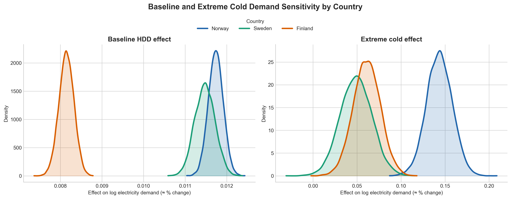
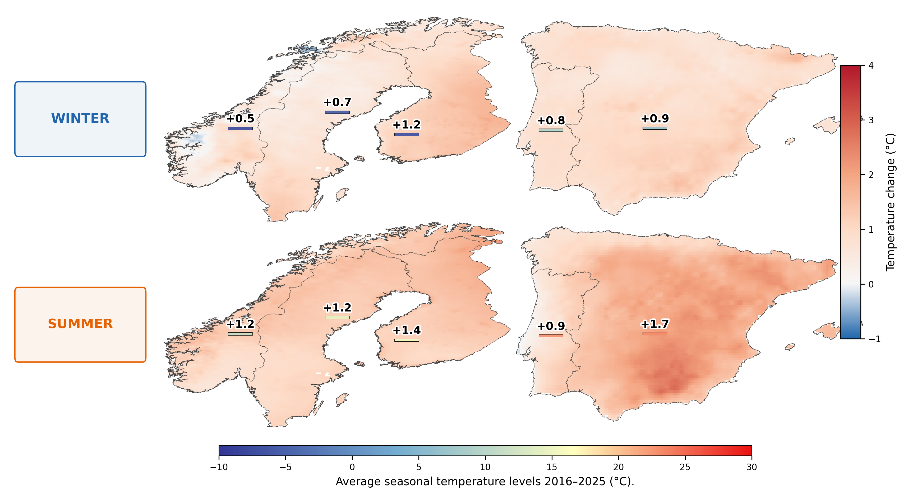

# Forecasting Electricity Demand in Nordic Power Systems

## 📌 Overview
Accurate electricity demand forecasting is essential for power system planning and electricity market operations. As weather patterns become more volatile due to climate change, understanding how temperature affects demand under different conditions has become increasingly important.

This project analyzes and forecasts daily electricity demand in **Norway, Sweden, and Finland**, focusing on how **temperature and demand volatility influence model performance**.

The analysis explicitly accounts for **extreme temperature events**, showing that demand responses are nonlinear and vary across regimes.

📄 [Read the full working paper on SSRN](https://dx.doi.org/10.2139/ssrn.6603718)

---

## ⚙️ Methodology

The project compares multiple forecasting approaches under different weather and demand conditions.

### Statistical Models
- **SARIMAX Full**  
  → Includes temperature, extreme weather indicators, holidays, and lagged demand variables.

- **SARIMAX Restricted**  
  → Parsimonious specification retaining only the most relevant weather and demand drivers.

### Machine Learning Models
- **XGBoost Full**  
  → Flexible nonlinear model using the full weather and demand feature set.

- **XGBoost Restricted**  
  → Reduced feature specification aligned with the restricted SARIMAX setup.

- **XGBoost No Weather**  
  → Benchmark machine learning specification excluding climate variables.

### Benchmark Model
- **Seasonal Naïve**
  → Baseline forecasting benchmark using weekly seasonal persistence.

---

## 🌡 Key Idea

Forecast performance is evaluated under **different demand regimes**, defined by:

- **Demand volatility** (based on large day-to-day changes)
- **Temperature-driven vs non-temperature-driven periods**

The analysis also captures **nonlinear temperature effects** by combining standard temperature measures (HDD/CDD) with **extreme temperature indicators**, allowing demand responses to vary across regimes.

---

## 📊 Evaluation

Model performance is assessed using:

- RMSE (Root Mean Squared Error)
- MAE (Mean Absolute Error)
- Seasonal and monthly analysis
- Volatility-based regime analysis
- **Diebold-Mariano tests** for statistical comparison

---

## 🔍 Key Findings

- Including **weather variables significantly improves forecast accuracy**
- **Extreme temperature effects are substantial**, highlighting nonlinear demand responses
- Standard **HDD/CDD measures alone are not sufficient** to capture temperature-driven demand dynamics
- **SARIMAX performs better** during temperature-driven volatility
- **XGBoost performs better** when volatility is not temperature-driven
- In Finland, where temperature sensitivity is weaker, model differences are smaller

👉 Overall:
> Forecast performance depends on how model structure interacts with temperature and demand regimes.

---

## 📊 Nonlinear Temperature Effects

<p align="center">
  
</p>

<p align="center">
  <em>Figure 1: Comparison of HDD-based (left) and extreme cold (right) demand sensitivities across countries. While HDD effects decline from Norway to Sweden to Finland, extreme cold responses remain strong and follow a different pattern, highlighting nonlinear and regime-dependent demand dynamics.</em>
</p>

---

## 🌍 Relevance

These findings are important for:

- Managing **weather-related risks** in electricity systems  
- Improving **forecast reliability under climate variability**  
- Supporting **energy market operations and planning**

---

## 📁 Project Structure

- [data/](./data)  
  Raw dataset (not public due to ENTSO-E data access restrictions).

- [gee/](./gee)  
  Google Earth Engine scripts used to extract Population-Weighted ERA5-Land weather data.

- [notebooks/](./notebooks)  
  End-to-end analysis workflow: data preparation, modeling, and evaluation.

- [src/](./src)  
  Modular Python utilities for:
  - data processing  
  - SARIMAX models  
  - XGBoost models  
  - evaluation and metrics  

- [outputs/](./outputs)  
  Final figures and tables used in the analysis.

---

## 🌍 Climate Change Visualization Tool

The `scripts/` folder includes a Google Earth Engine (GEE) script that visualizes regional climate-change patterns using ERA5-Land temperature data.

The tool compares multi-year seasonal averages:

- **Baseline period:** 1990–1999  
- **Recent period:** 2016–2025  

### Default comparison:
- **North:** Norway, Sweden, Finland  
- **South:** Spain, Portugal  
- **Seasons:** Winter and summer  

The numerical labels show country-level average seasonal warming, while the small colored strips below the labels indicate recent-period absolute seasonal temperature levels during 2016–2025.

### Requirements

Users must create their own Google Earth Engine account:

👉 https://earthengine.google.com/

Authenticate locally:

```bash
earthengine authenticate
```

---

<p align="center">
  
</p>

<p align="center">
  <em>Figure 2: This shows evidence of warming across all countries; however, substantial regional climatic differences remain. Nordic countries continue to experience colder winters and milder summers relative to Southern Europe, implying that electricity demand in the Nordics remains more strongly associated with heating requirements, whereas warmer Southern European climates are increasingly exposed to cooling-related demand pressures under climate change. </em>
</p>

---

## 📌 Countries Analyzed

- Norway 🇳🇴  
- Sweden 🇸🇪  
- Finland 🇫🇮  

---

## 🚀 Tools & Libraries

- Python
- pandas, numpy
- statsmodels (SARIMAX)
- xgboost
- shap
- matplotlib, seaborn
- scipy

---

## 👤 Author

**Samuel Kwesi Kumi**